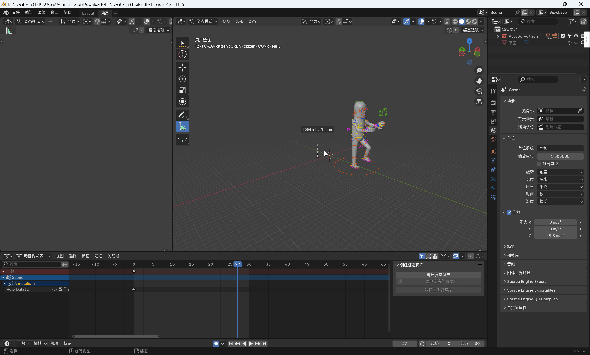

# fbx是sbox的最主要的格式
默认的橡皮人模型路径
> steams\steamapps\common\sbox\addons\citizen\Assets\models\citizen

[这个超链接是官方推荐的人物模型。](https://github.com/Ali3nSystems/Ecodelia-Tools-for-Facepunch-Assets/blob/main/MDL-citizen/control_rig(s)/BLND-citizen.blend)

> 

---

## 前言

blender和sbox的单位不同，blender使用的公制单位为米，sbox使用的单位为英寸。而且blender默认的fbx编辑器只能使用米作为单位，所以我们应当设置

还可以放大一些blender的显示范围 

当然骨骼的坐标轴也会有问题

导入fbx格式，选择自动骨骼坐标

 可以看到这个模型在1.6m左右
 

---

追加动画

注意新打开一个blnder窗口！！！
注意新打开一个blnder窗口！！！
注意新打开一个blnder窗口！！！
---
导入选择的动画，我这里框选里20多个fbx文件，稍等一会。

如图

另存为blender文件
另存为blender文件
另存为blender文件
别告诉我你不会另存为blender文件
---
打开之前只有模型的窗口。
打开之前只有模型的窗口。
打开之前只有模型的窗口。
---
追加

双击

导入action文件夹的内容

可以看到在动作编辑器中有许多之前的动作，您可以预览这些动作。
~~看着好别扭。~~

至此，导入fbx文件结束，您可以使用blender来完成一些新的动作。

---
我在这里制作了一个动作

---

导出fbx格式

如果要导出动画，要勾选动画的选项。

