## 前言
这部分需要对blnder有一些要求，但是静态模型相对简单。难点在于材质贴图的使用。

---
### 1.网上随便找一个开源的blender模型 
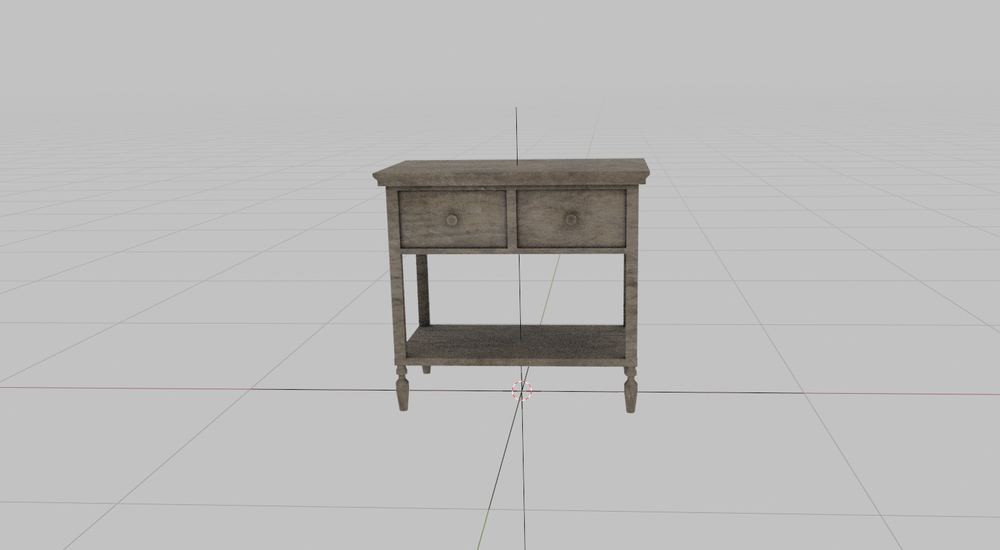

### 2.导出模型
这次不选导出动画
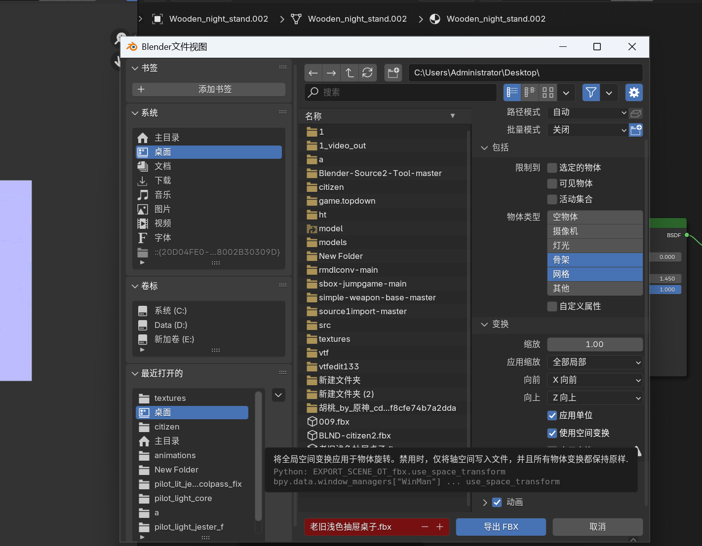
### 3.导出材质
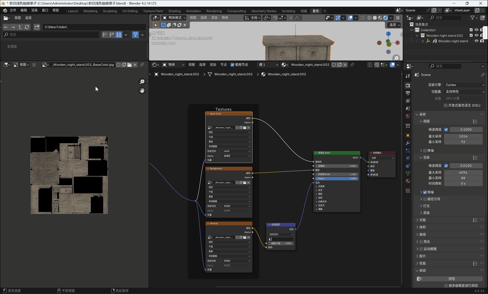
材质的我就不多说了，blender里面会涉及到。

### 4.组装材质
将我们的材质和模型放到项目的目录下。
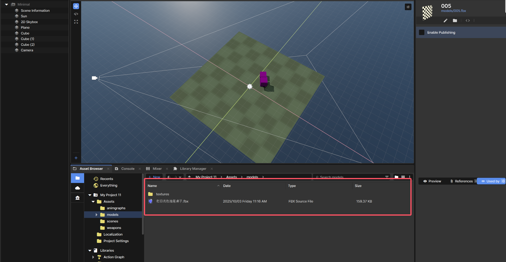
材质编辑器
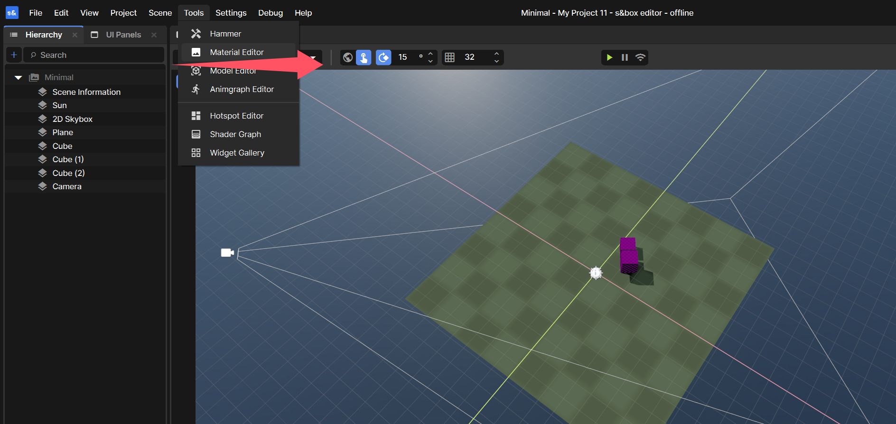
新建材质，并保存材质到项目目录下
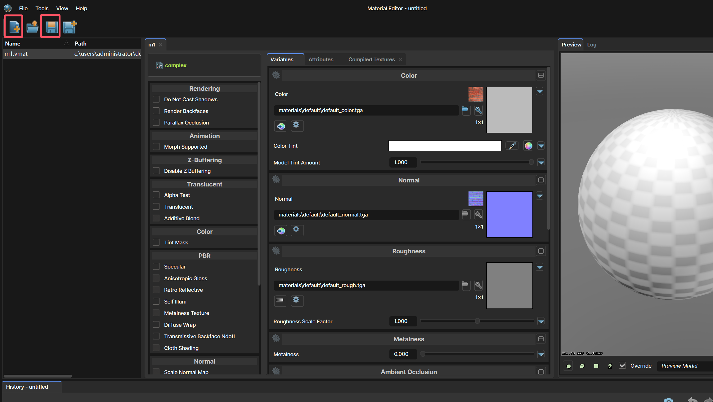
选择这3个材质（有的blender模型会有4个材质等等，我的建议是删除多余的材质，或者您可以使用blender的材质编辑器合并材质）
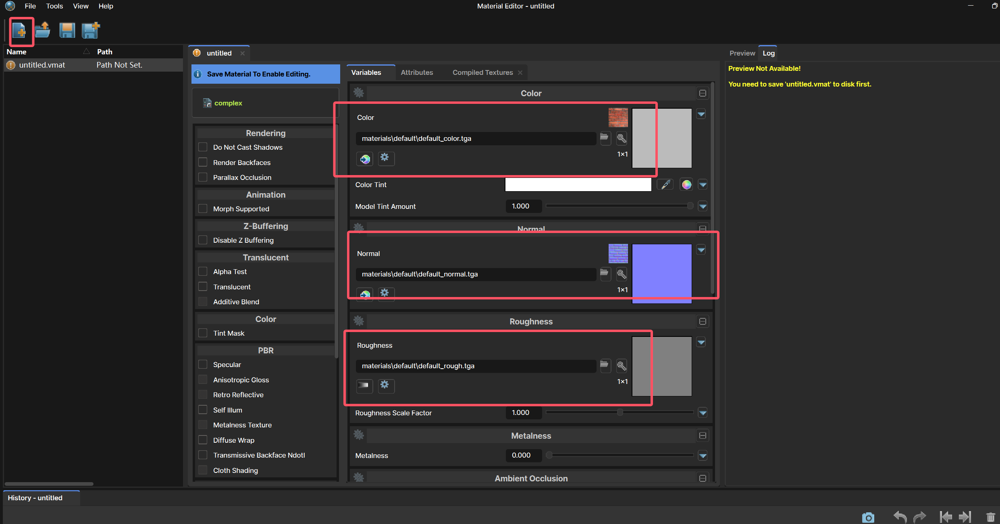
这样就差不多了，太复杂的等我学习完成之后再说。
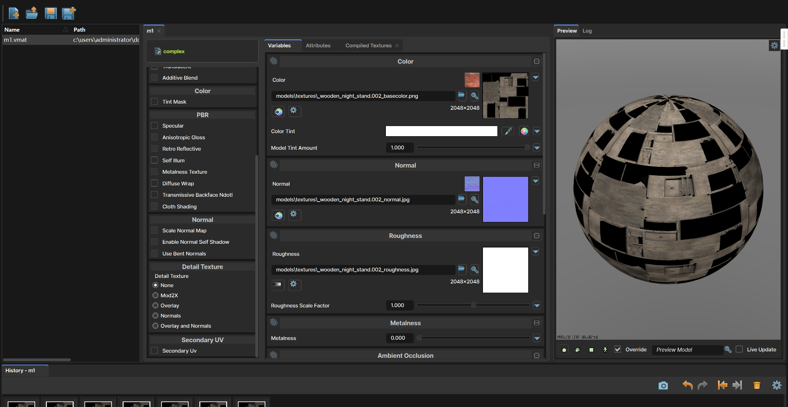

### 5.导入模型

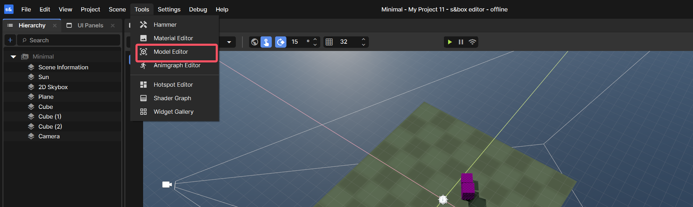
导入模型 
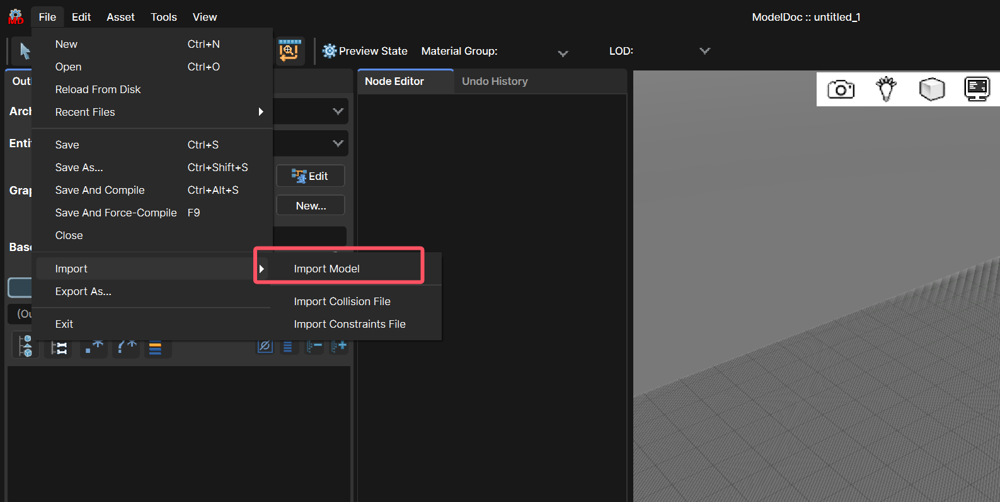
编译 并保存在项目目录下，每次修改完都需要编译才能看到结果
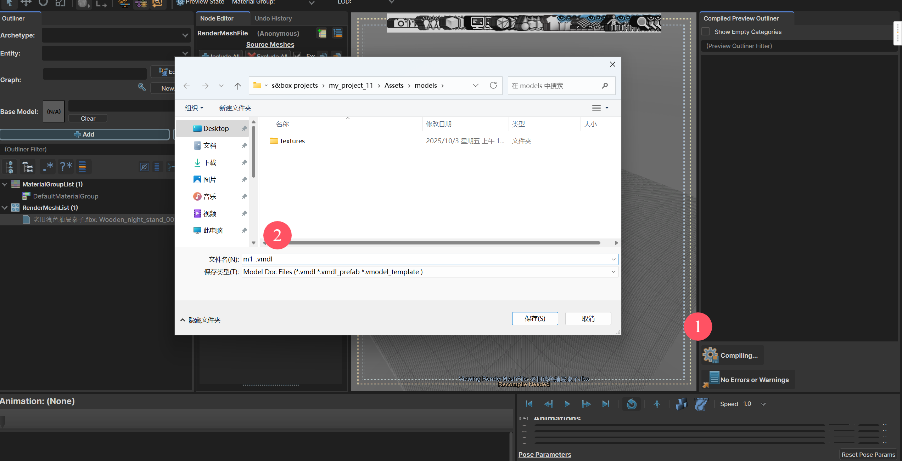
更换我们的材质
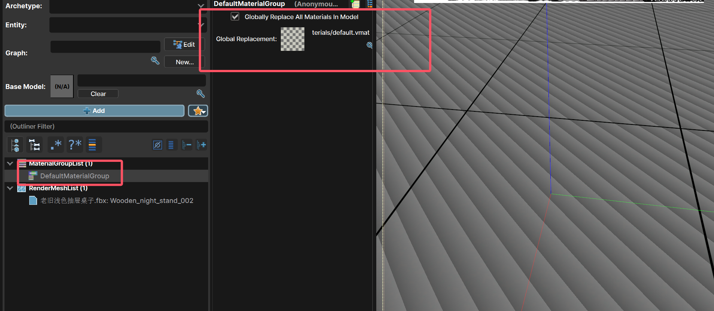
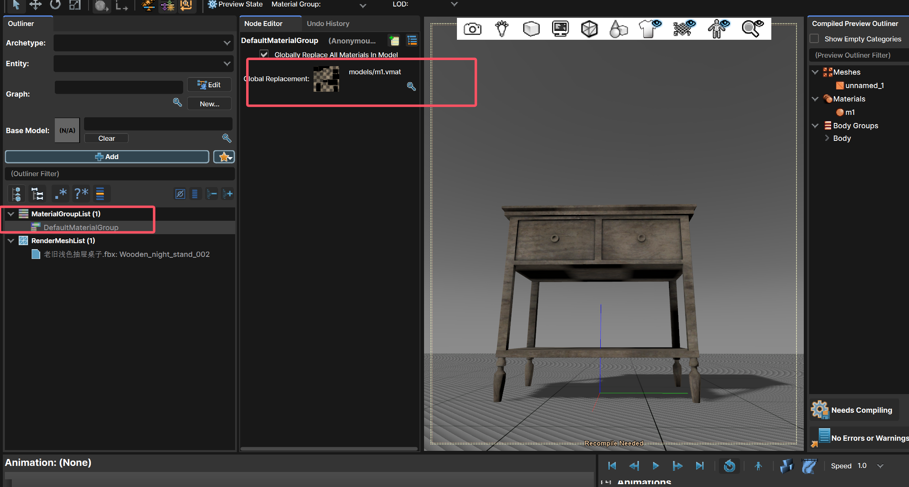
增加一个碰撞盒，可以搜索phy 选择相应的碰撞盒。我这里选择了一个。
过于复杂的碰撞盒对性能是一个不小的负担。
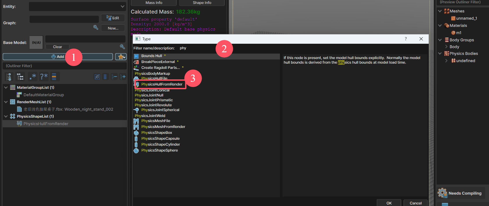
编译成功
拖入游戏中：
