# hammer 地图编辑器
---
## 一、简介
hammer 是一个用于构建起源引擎地图的编辑器。在sbox中，你可以使用hammer来创建地图，并使用地图编辑器来编辑地图。
cs2的地图就是用这个来编辑的，所以这个教程主要是根据cs2来编写。
~~道听途说，Garry 好像要删除这个地图编辑器，但是因为玩家社区的反对不了了之。~~

---
## 二、启动hammer

> 在sbox中启动hammer
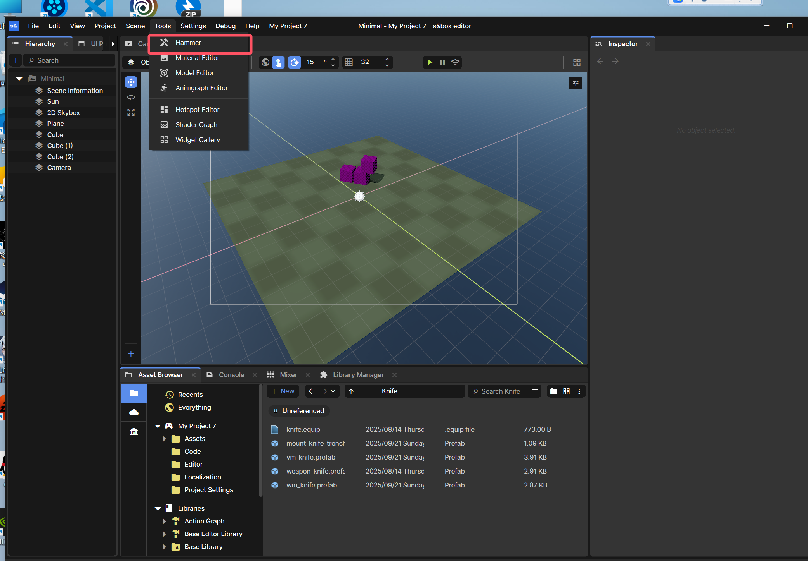

>  在cs中启动hammer
>> cs2 安装 dlc cs workshop tools
>> 启动前编辑
开始游戏 选择 tools
选择 launch tools
选择 hammer
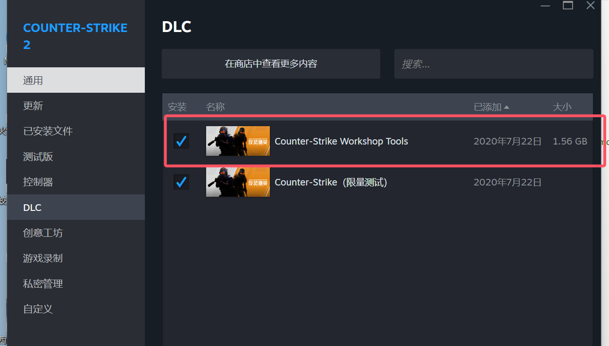
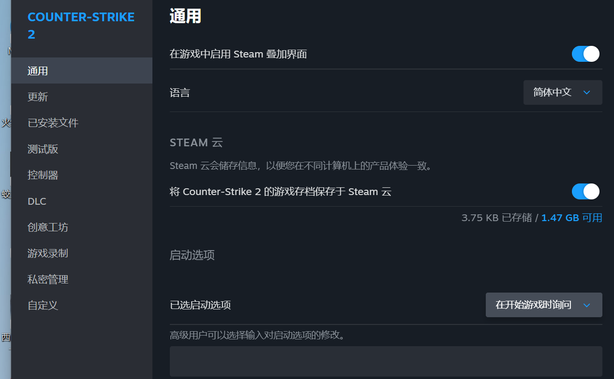
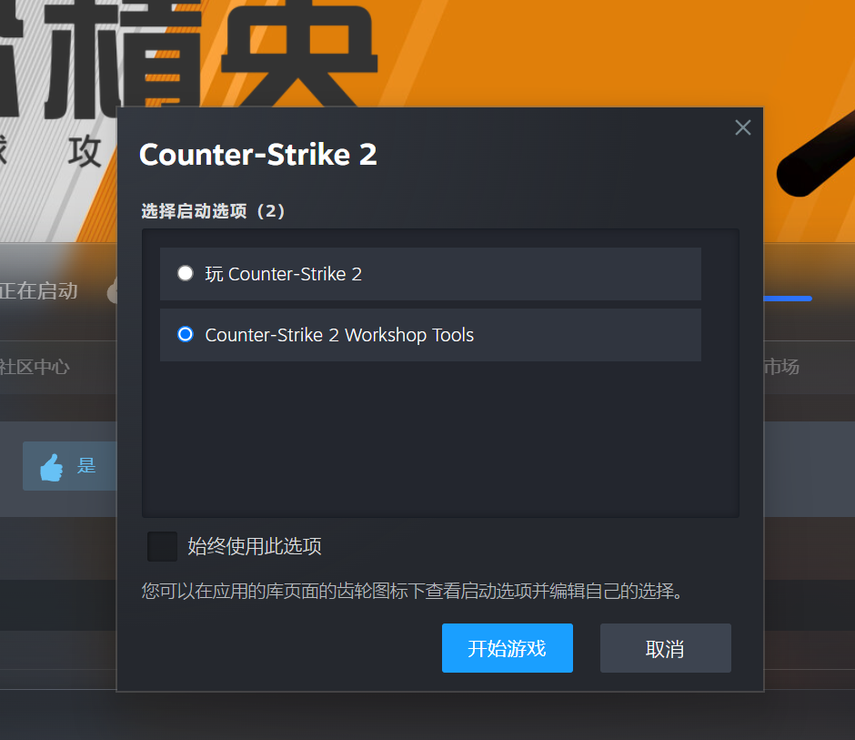
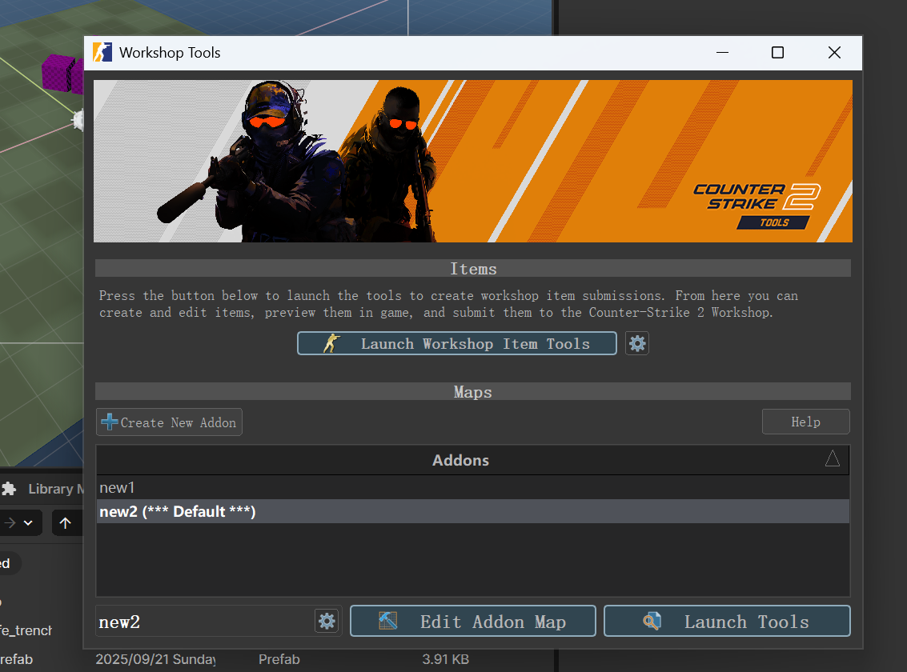
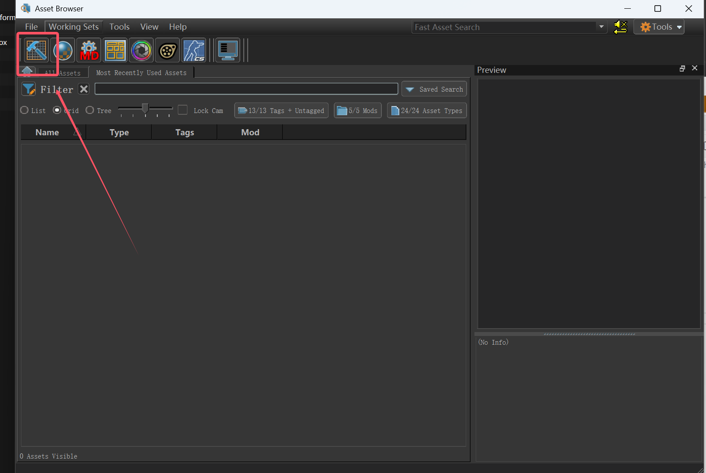

可以看到两者基本一致 
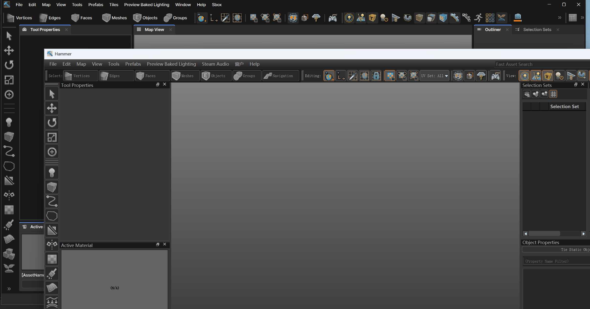

新建模板地图
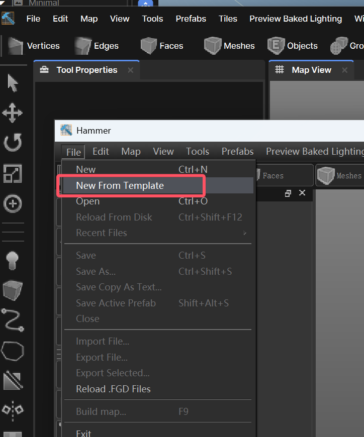
依旧是wasd 移动 鼠标左键调整方向

**好 编译模板地图**
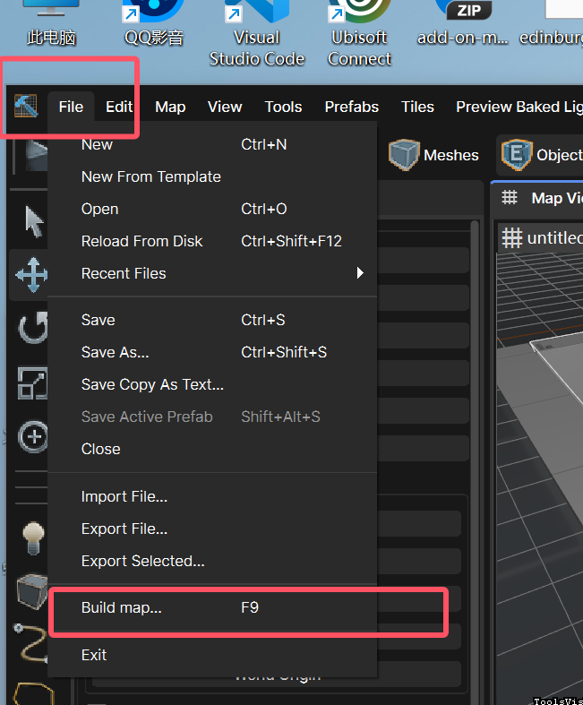
**build**
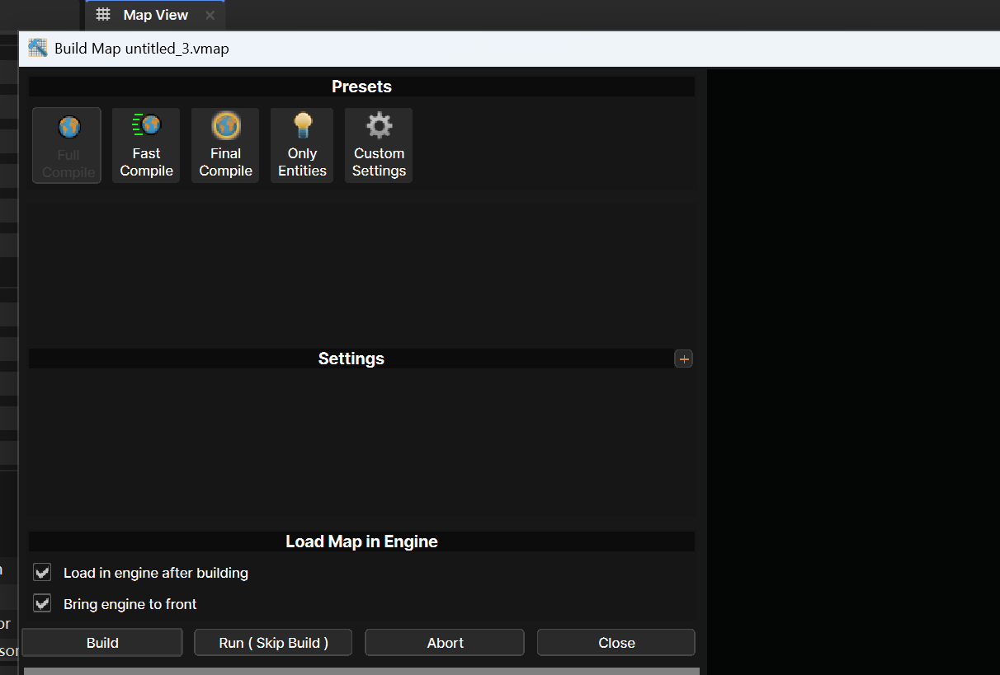
正常的 cs会跳出游戏窗口。
而sbox 需要到 资源浏览窗口 找到保存的地图,拖入在场景中。
一般在 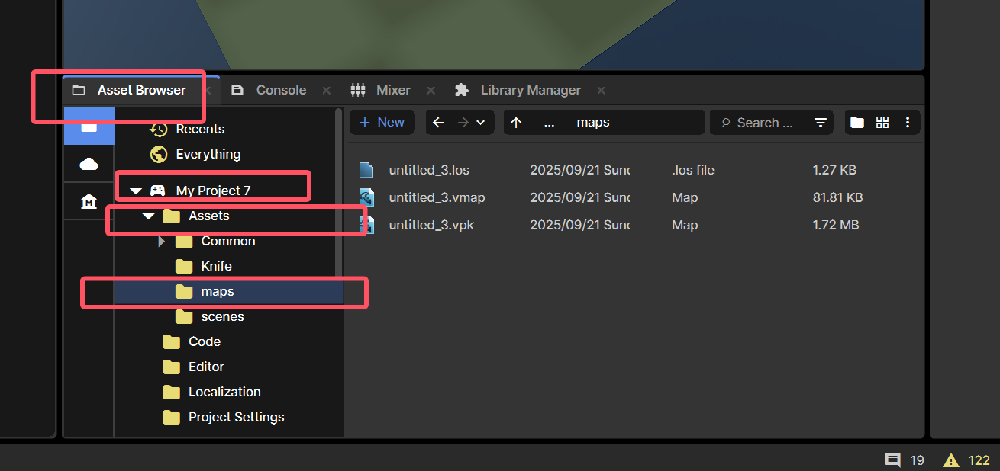
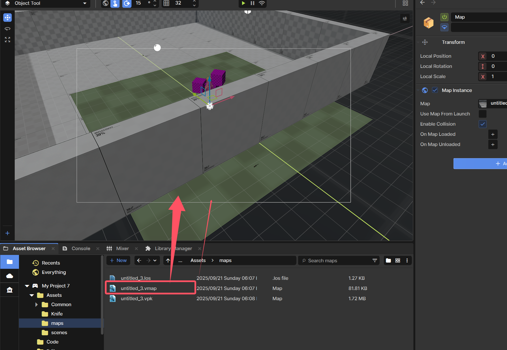
创建一个玩家控制器 在sbox中查看他
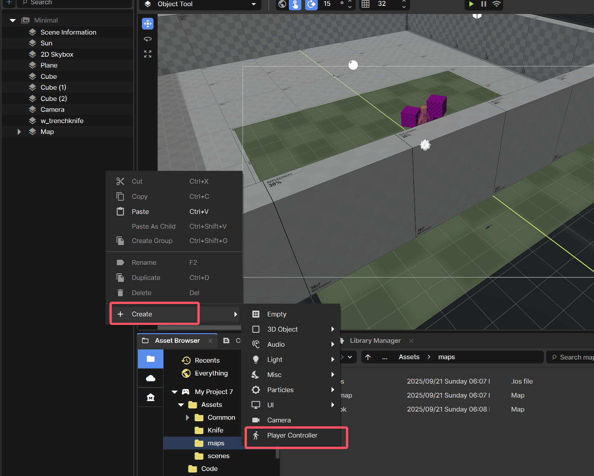

~~现在你已经掌握里全部的用法，开始设计你的地图吧！~~

---

